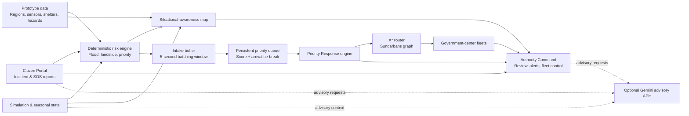

# TRATA

> A disaster-management and emergency-response prototype for the Sundarbans, West Bengal.

TRATA brings together citizen incident reporting, multi-hazard risk assessment, map-based situational awareness, rescue-fleet coordination, public-alert workflows, and graph-based priority response in one application. It is designed for demonstration, academic, and prototype use only. The routing network and operational data are deterministic sample data—not live emergency-dispatch, road-navigation, or public-safety systems.

## Deployed application

TRATA is deployment-ready as a single Express application that serves the Vite client in production. Its hosted URL is supplied at deployment time through the `APP_URL` environment variable.

> **Live link:** Add the production `APP_URL` here after deployment. The tracked environment template intentionally contains `MY_APP_URL`, not a public deployment address.

## What TRATA does

- Lets citizens submit location-aware incident and SOS-style reports.
- Calculates deterministic flood, landslide, and composite location-risk assessments.
- Provides map views for incident reports, hazard zones, sensors, shelters, and rescue units.
- Gives authorities an operational command view for reviewing incidents, assigning fleets, and issuing public alerts.
- Simulates changing disaster conditions, seasonal context, IoT telemetry, shelter capacity, and historical analysis.
- Prioritizes incoming incidents, allocates personnel, and finds routes through a deterministic Sundarbans graph.
- Uses optional Gemini endpoints for advisory intelligence, triage, briefings, broadcasts, hazard prediction, fusion intelligence, and lifecycle strategy. Deterministic application logic remains authoritative for operational scores, routing, and allocation.

## Architecture



### Request and runtime model

```text
Browser (React + Vite)
  ├─ UI modules: map, citizen portal, authority command, risk engine,
  │  digital twin, IoT telemetry, shelters, historical analysis, fusion intelligence
  ├─ deterministic client-side risk and priority-response logic
  └─ /api/* requests
          │
          ▼
Express server (server.ts)
  ├─ /api/health
  ├─ optional Gemini-backed advisory endpoints
  ├─ development: Vite middleware
  └─ production: serves the built client from dist/
```

## Core workflow

1. **Observe risk** — Simulation inputs, sensor telemetry, prototype region data, and deterministic calculators generate risk context.
2. **Report an incident** — A citizen report includes the hazard, description, location, affected people, and incident-priority information.
3. **Assess and visualize** — TRATA presents reports alongside hazards, shelters, rescue units, and map context.
4. **Batch and prioritize** — Reports enter an in-memory intake buffer before being inserted into the persistent priority queue.
5. **Plan a response** — The response engine determines personnel needs, maps the report to the nearest graph node, and evaluates routes to government centers.
6. **Assign a fleet** — The authority workflow assigns an eligible center-associated fleet when a route is feasible and personnel are available.
7. **Track and recover** — Fleet and incident status progress through dispatch, service, return, maintenance, and availability recovery.

## Priority-response system

The priority-response module is integrated into the host application rather than deployed as a separate service. The upstream incident `priorityScore` is the source of truth throughout dispatch processing.

### Intake buffer and queue

New incidents first enter an in-memory intake buffer. The configurable `PRIORITY_BUFFER_WINDOW_MS` is currently five seconds, allowing closely arriving reports to be batched before ordering. The buffer neither routes nor sorts incidents.

When the window ends, reports move to the persistent `PriorityQueue`, which orders entries by descending upstream priority score. Equal scores use deterministic arrival-sequence tie-breaking. The highest-priority pending incident is selected first.

Dispatch is non-preemptive: a report that arrives during an active response waits in the intake buffer. When the active response completes, buffered reports are moved to the same priority queue and the next highest-priority incident is selected.

### Personnel allocation

| Priority score | Personnel assigned |
| --- | ---: |
| 80–100 | 10 |
| 65–79 | 8 |
| 45–64 | 6 |
| Below 45 | 4 |

### Routing

The deterministic Sundarbans prototype network contains 55 nodes: 50 location/road nodes (`s-01` through `s-50`) and five government-center nodes (`g-01` through `g-05`). Nodes use static coordinates and manually defined weighted, undirected connections. Weights use Haversine geographic distance.

For each incident, TRATA maps the report coordinates to the nearest graph node. A* routing uses accumulated distance as `g(n)` and Haversine distance to the destination as `h(n)`. Unavailable edges are ignored. Every available government center is evaluated; the reachable center with the shortest route is selected. If none is reachable, the result is `NO_FEASIBLE_ROUTE`.

Graph availability can be changed around incident-area coordinates. Blocking affects edges associated with the nearest graph node; recovery restores those edges without changing their underlying distance.

## Major application areas

| Area | Purpose |
| --- | --- |
| Disaster Map | Visualizes reports, hazard zones, sensors, shelters, and rescue units. |
| Citizen Portal | Captures incident reports and provides citizen-facing safety and location tools. |
| Authority Command | Supports incident review, response results, fleet coordination, operational messages, and public-alert controls. |
| Risk Engines | Produces deterministic flood, landslide, composite-risk, and location-risk outputs. |
| Digital Twin & Story | Simulates disaster stages and explains the operational workflow. |
| IoT Telemetry | Displays prototype sensor telemetry and supports simulated sensor deployment. |
| Shelters | Presents shelter availability and capacity context. |
| Historical Benchmarks | Provides historical-analysis views. |
| Fusion Intelligence | Brings together multi-source operational intelligence and optional AI advisory context. |

## Optional Gemini advisory features

Set `GEMINI_API_KEY` to enable server-side Gemini requests. The server exposes these advisory endpoints:

| Endpoint | Purpose |
| --- | --- |
| `GET /api/health` | Returns service status and whether a Gemini key is available. |
| `POST /api/ai/risk-intelligence` | Interprets deterministic risk-engine outputs. |
| `POST /api/ai/situation-briefing` | Produces an incident-command briefing. |
| `POST /api/ai/triage-report` | Provides incident triage advice. |
| `POST /api/ai/broadcast-generator` | Generates multi-channel public-alert content. |
| `POST /api/ai/predict-hazards` | Produces advisory hazard-escalation context. |
| `POST /api/ai/fusion-intelligence` | Produces fusion-intelligence context. |
| `POST /api/ai/lifecycle-strategy` | Produces lifecycle strategy context. |

Without a Gemini key, the application uses implemented deterministic fallback responses where available. AI output is advisory; it does not replace the deterministic risk, priority, routing, or personnel-allocation logic.

## Project structure

```text
src/
├── App.tsx                         # Application integration and operational state
├── components/                     # User-interface modules
├── data/
│   └── disasterData.ts              # Prototype region and simulation data
├── priorityResponse/
│   ├── types.ts                     # Priority-response domain contracts
│   ├── graph.ts                     # Graph state, Haversine, availability, coordinate mapping
│   ├── graphData.ts                 # Static nodes and manually defined edges
│   ├── priorityQueue.ts             # Persistent ordering and tie-breaking
│   ├── astar.ts                     # A* pathfinding and center selection
│   ├── responseEngine.ts            # Buffer lifecycle and dispatch orchestration
│   └── tests/
│       └── priorityResponse.test.ts # Priority-response tests
├── types.ts                         # Shared application types
├── utils/
│   ├── riskCalculators.ts           # Flood, landslide, and response-priority calculations
│   └── sundarbansRiskNormalization.ts
└── main.tsx                         # React entry point
server.ts                            # Express API and optional Gemini integrations
public/                              # TRATA visual assets
```

## Run locally

**Prerequisite:** Node.js

1. Install dependencies.

   ```bash
   npm install
   ```

2. Create `.env` from the provided example and, if needed, add your Gemini API key.

   ```env
   GEMINI_API_KEY=your_gemini_api_key
   APP_URL=http://localhost:3000
   ```

3. Start the development server.

   ```bash
   npm run dev
   ```

4. Open [http://localhost:3000](http://localhost:3000).

## Validation

```bash
npm test
npm run lint
npm run build
```

- `npm test` runs the priority-response test suite.
- `npm run lint` performs TypeScript checking.
- `npm run build` builds the production client and server bundles.

## Scope and safety note

TRATA is a prototype. It must not be used as a live emergency-dispatch, navigation, safety-critical risk-scoring, or public-alerting system without appropriate real-world data sources, validation, operational safeguards, and authorized emergency-management oversight.
